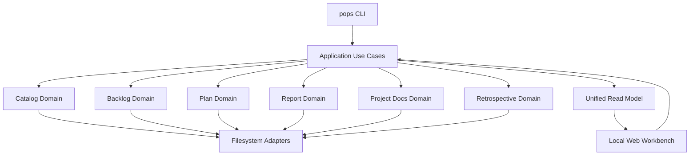

# ProjectOps 架构

## 架构概览

ProjectOps 采用 TypeScript/Node.js 单运行时 modular monolith。CLI、Local Web Workbench 和未来 Agent 接口
共享 application/domain implementation；模块间不通过 CLI subprocess 通信。



当前 Repo 已落地 Workspace/Catalog、Backlog、Plan authoring/query/validation/approval/materialization、Project Docs
scaffold/check，以及 Report@1 schema、Markdown filesystem adapter、单 Plan Report 生成资格校验和
`pops report create/list/show`；独立临时 workspace 的 built CLI smoke 已覆盖 Plan → Backlog → Report 的
completed 路径、logical references、验证证据和 no-clobber 行为。Retrospective 的 Retrospective@1/Store@1 schema、workspace manifest 路由、Markdown store bootstrap、可重建索引、capture/query 与 revision-protected triage/archive lifecycle 已落地；独立临时 workspace 的 built CLI E2E 还验证了 metadata 保留、唯一 authority 移动、索引计数和 stale revision 不变式。Workbench 的 UI-neutral typed Application API、按请求重建的 workspace/project Read Model、loopback-only Local HTTP server 以及基于纯 TypeScript/原生 ESM 的可导航 Workbench 前端壳已落地，生产 build 由本地 server 直接托管；Backlog 可写切片、Plan/Report/Retrospective 阅读视图和 Docs 文档阅读已交付。上图是新增纵向能力时必须保持的目标依赖方向。

## 核心技术栈

| 层 | 技术 | 当前选择理由 |
|---|---|---|
| Runtime | Node.js 22+ | CLI、server 和构建使用单运行时 |
| Language | TypeScript | 共享 domain、application、CLI 和 Web contract |
| Package manager | npm | 降低初始工具数量 |
| Persistence | Markdown/JSON files | 人类可读、Git-friendly、Agent 可操作 |
| Tests | Node test runner + tsx；Playwright Test + Chromium | Node 测试覆盖领域与 HTTP，浏览器 E2E 验证生产 UI 闭环 |
| HTTP | Node.js `node:http` | 直接复用单运行时，不增加 server framework |
| Web UI | 纯 TypeScript + 原生 ESM + 现代 CSS | 保持单运行时与零重型外部依赖，兼顾可访问性与直接静态托管 |

## 模块边界

```text
interfaces (CLI/Web)
        ↓
application use cases
        ↓
domain modules
        ↓ ports
filesystem/runtime adapters
```

- Domain 不读取 Catalog、环境变量、HTTP request 或 CLI arguments。
- Catalog 只拥有 workspace/project topology，不解析领域 artifact 内容。
- Application 层编排跨领域 use case，不复制领域状态机。
- Read Model 是可重建 projection，不是业务 authority。
- 新抽象必须至少解决当前存在的两个调用方或重复问题。

当前代码结构：

```text
src/
  cli.ts                  interfaces：进程入口，注入 stdout/stderr/stdin
  workbench.ts            interfaces：Local HTTP server 进程入口与 signal shutdown
  app.ts                  application：命令路由与退出码
  io.ts                   CliIO 契约
  application/
    result.ts             UI-neutral typed success/error contract
    workspaceApi.ts       workspace identity 与 project summaries 查询
    backlogApi.ts         Backlog list/show/revision-protected update API
    workspaceInspection.ts workspace doctor 的 typed inspection API
    workbenchReadModel.ts workspace/project 跨领域只读 projection
    docsApi.ts            文档列表与单篇正文的共享 application API
    planExecution.ts      Plan mapping 与同项目 Backlog 的实时执行进度 projection
    planNext.ts           Plan 查询与共享就绪任务分类、排序、依赖诊断
  server/
    workbenchServer.ts    HTTP routes、request boundary、static assets 与 server lifecycle
  web/
    index.html            Workbench HTML 骨架与挂载点
    theme.css             深色主题变量、基础元素、全局内容链接及焦点样式
    style.css             导入 theme.css，承载组件样式、页面布局与响应式规则
    types.ts              前端 AppState、ViewType 与只读模型契约
    router.ts             URL Hash 路由解析、格式化与状态恢复
    apiClient.ts          HTTP API 客户端与网络/格式错误收敛
    backlogController.ts Backlog 列表、详情、revision mutation 与异步响应隔离
    backlogView.ts        Backlog 分组列表、详情、依赖提示和更新控件
    markdown.ts           五类内容共用阅读子集与源码切换，HTML 转义、受限链接和标题回调
    docsView.ts           文档导航、正文、章节目录及相对链接解析
    state.ts              前端状态机核心与不可变状态转移
    readPagesView.ts       Plan/Report/Docs/Retrospective 只读详情与回顾过滤
    render.ts             语义化 HTML 纯函数渲染与可访问性属性
    app.ts                生命周期编排、事件委托与 DOM 挂载
  catalog/
    workspace.ts          Catalog domain：Manifest@1 schema 与纯路径逻辑
    workspaceStore.ts     filesystem adapter：发现、读写 workspace manifest
  backlog/
    store.ts              Backlog domain：store manifest schema
    add.ts                Backlog application helper：CLI 与 Plan materialization 共享 item 创建规则
    item.ts               Backlog domain：item schema、frontmatter 序列化、revision
    storeFs.ts            filesystem adapter：store 创建与读取
    itemFs.ts             filesystem adapter：item 文件读写
  plan/
    plan.ts               Plan domain：Plan@1 schema、校验与生命周期
    planFs.ts             filesystem adapter：Plan artifact 的列出、读写与解析
  report/
    report.ts             Report domain：Report@1 schema 与稳定 Markdown 序列化
    reportFs.ts           filesystem adapter：Report 的 containment、列出、读取与 no-clobber 创建
  retrospective/
    retrospective.ts      Retrospective@1 与 Store@1 schema、Markdown 序列化
    retrospectiveFs.ts    workspace-level store bootstrap、containment、capture、读写、revision-protected transition 和索引重建
  docs/
    projectDocs.ts        Project Docs domain：固定角色和内置 Markdown 模板
    projectDocsFs.ts      filesystem adapter：预检、canonical containment、no-clobber scaffold
    documentReader.ts     有界 Markdown 枚举与只读文件读取，静态 ancestor/target 校验
  useCases/
    docsScaffold.ts       application：创建固定 Project Docs 文件
    docsCheck.ts          application：只读检查固定 Project Docs 文件
    reportContext.ts      application：解析已登记 project 的 typed reports root
    reportGenerate.ts     application：从持久化 materialized Plan 与同项目 Backlog 生成 Report
    reportCreate.ts       application：`pops report create` 参数解析与 Report 生成入口
    reportList.ts         application：`pops report list` 摘要查询
    reportShow.ts         application：`pops report show` 完整查询
    retrospectiveContext.ts application：解析 Manifest@1 的 workspace retrospectives descriptor
    retrospectiveCapture.ts application：`pops retrospective capture` 参数校验和 inbox 写入
    retrospectiveList.ts application：`pops retrospective list` 过滤和 malformed diagnostics
    retrospectiveShow.ts application：`pops retrospective show` 完整记录查询
    retrospectiveTriage.ts application：`pops retrospective triage` 分类并将 inbox 记录移入 active/archive
    retrospectiveArchive.ts application：`pops retrospective archive` 将 active 记录结案到 archive
    ...                    每个 CLI 子命令一个 use case，编排 domain 与 adapters
```

`src/application/` 是 CLI、Local Web Workbench 与未来 Agent interface 的共享调用面。它接收 typed request，
返回 `ApplicationResult<T>`，不解析 CLI arguments、不格式化 JSON、不依赖 `CliIO`、HTTP 或 UI 类型，也不在
错误结果中暴露机器绝对路径。当前覆盖 workspace/project 查询、Backlog
list/show/update 以及四个领域的完整只读 projection；现有 CLI 对应命令负责参数、文本/JSON 输出和退出码，并把业务处理委托给这些 API。其他
领域仍按需求逐步迁移，不建立通用 command bus 或 Artifact service。

`workbenchReadModel.ts` 直接组合各领域公开读取能力。workspace overview 包含 workspace identity、稳定排序的
project summaries 与 doctor diagnostics；project overview 包含 Backlog 状态计数/最近条目、Plan/Report 摘要、
Docs check、project-scoped Retrospective 计数和最近记录。projection 不保存状态；malformed artifact 或单领域
不可用时返回按 source/reference 稳定排序的 diagnostics，并继续返回其他可用领域，不复制 schema parser。

`workbenchServer.ts` 是 application API 外的薄 HTTP adapter。启动参数固定唯一 workspace，并默认绑定
`127.0.0.1:7331`；host 只接受 loopback，测试可使用 port `0` 获取隔离端口。路由提供 workspace/project
overview、Backlog list/show/update、Docs list/show 和 `GET /api/projects/<id>/read-pages`，统一返回 `{ ok, data }` 或 `{ ok, error }` JSON envelope，并把 stale
revision 映射为 HTTP 409。请求不能提供 workspace path；除 Backlog list 的 `status` 和 Docs show 的 `path` 外拒绝 query 参数。
PATCH 接受 `application/json`、无 Origin 或与 server origin 完全相同的 Origin，以及有界 body；状态更新与内容编辑分开校验，内容编辑要求 revision。server 可从显式 static root 提供前端资源，realpath containment 防止 URL
访问 root 外文件；未提供 static root 时自动查找内置 `dist/web` 生产资源，只有资源尚未构建时才返回占位页。
关闭先停止接收连接，随后有界清理残留连接。

`getWorkbenchReadPages` 与 overview 共享 Plan/Report/Retrospective 领域读取器和 Docs check，返回 `WorkbenchReadPages`：
Plan、Report 保留各自 domain 类型，Docs 从 `PROJECT_DOC_TEMPLATES` 派生固定路径及检查结果，Retrospective
返回完整 workspace 记录。单个 malformed 文件被转换为诊断，不中断其他有效文件；不通过 CLI subprocess、
CLI JSON 或前端 schema parser 读取数据。此 projection 按需从 read-pages endpoint 加载，Alpha 阶段一次返回
四个领域的完整内容，无分页或持久化缓存；overview 继续保留轻量摘要契约。

`readPagesView.ts` 以原生 `<details>` 提供可键盘展开的 Plan、Report 和 Retrospective 详情，Report/Retrospective 正文默认通过共享阅读组件渲染，源码可切换；正文和关键行动优先，metadata 折叠。Plan 采用任务目录与独立折叠正文，技术记录单独折叠。
Retrospective 在完整 typed 列表上按 status/project/task 精确过滤，默认 project 为当前项目，留空表示全部，
`null` 表示 provenance 未记录；按 inbox/active/archive 分组并保留不受过滤影响的 malformed diagnostics。
Docs 页面独立调用 docs endpoint 获取列表和单篇正文，`read-pages.documents` 仍仅保留固定路径检查摘要。`app.ts` 管理按需加载、重试、刷新和过滤状态，使用请求序号隔离过期响应；
项目切换清除旧 projection 并重置过滤。Report、Retrospective、Docs 保持只读；Plan 修订由独立 application API 提供，Docs 仅提供限定文档范围的读取接口。

Workbench Backlog 页面通过 HTTP list/show/update 获取完整数据，独立于 overview 的最近五条摘要。
`backlogController.ts` 管理列表、当前详情和提交状态：提交携带已加载 revision，成功后重读列表和详情并刷新
project overview；409 保留旧详情和当前选择，用户显式刷新后才能再次提交。项目切换会废弃旧请求的 UI
结果，进行中的提交不允许重复触发。页面依据 `depends_on` 与已读取 item 状态显示未完成/缺失依赖提示，
不引入额外的 mutation 规则。五个内容页面经 `markdown.ts` 渲染受限阅读子集，所有输入文本转义；HTTP(S) 外链可点击，Docs/Report 通过各自链接解析器生成受限内部路由；
原始 HTML、图片及未支持语法不执行，可展开源码切回原文。源码模式与 details 展开状态仅保存在会话内存，
`app.ts` 按项目和条目 key 在重新渲染时恢复，不增加持久化状态；Plan 目录通过 DOM 定位，不改写 router hash。
workspace 连接重试期间的路由变化只更新目标路由，待 workspace 响应到达后再加载项目。

测试以隔离临时 workspace、port `0` 和真实 HTTP API 覆盖列表、DOM 事件分发、更新后的 authority 文件、
project summary、revision conflict 与刷新重试；只读视图测试覆盖四领域正常、空状态与诊断、完整详情、回顾过滤、刷新和读取前后文件不变；
异步单元测试覆盖项目切换和重复提交。

`tests/browser/` 与 `playwright.config.ts` 提供独立 `npm run test:e2e` 门禁。它先构建，使用 built CLI
在每项测试的 `mkdtemp` workspace 中准备数据，再启动 `dist/workbench.js --port 0` 子进程，读取实际绑定地址。
真实 Chromium 从 server 托管的 `dist/web` 加载前端，使用可访问性 locator 操作项目选择、导航、详情、
Backlog 状态更新与冲突重试、Retrospective 过滤；文件快照核对只读浏览、stale revision、未知项目及
server 断连均不产生错误写入。测试不用真实用户 workspace，不依赖预先启动的固定端口服务。

fixture 的 CLI 调用与 server 启动各限时 10 秒；Playwright browser launch/navigation 限时 10 秒，
action/assertion 限时 5 秒，单测试 30 秒、整套 120 秒，不自动重试。server 在 fixture `finally` 中发送
SIGTERM，2 秒未退出则 SIGKILL，4 秒仍未退出则报错；随后清理本次临时目录。浏览器和隔离 context
由 Playwright fixture teardown 关闭，失败 trace 留在 Git 忽略的 `test-results/`。测试采用受信任本地
临时目录边界，不增加 native helper 或恶意 ancestor-swap 承诺。Playwright 仅是 devDependency，生产运行时仍为 Node.js。

## 数据文件格式

- workspace manifest：`.pops/workspace.json`，schema `workspace/Manifest@1`；不含绝对路径，project 以
  相对路径登记；顶层 `retrospectives` descriptor 使用 `type: workflow/retrospectives@1` 与相对 `root` 指向
  唯一 workspace-level Retrospective store，默认由 `pops init` 写入 `retrospectives/`。
- backlog store：`ops/<project-id>/backlog/`，含 `backlog.json`（`backlog/Store@1`，声明
  project_id 与 id_prefix）、`items/` 与 `INDEX.md`。
- backlog item：`items/<ID>.md`，YAML 风格 frontmatter + Markdown body；`revision` 是其余内容的
  sha256 前 8 位，用于 `update --expected-revision` 的冲突保护。
- `INDEX.md` 是从 item 文件重建的可读 projection；add 和真实状态变更后同步刷新，no-op 不改写。
- Plan：`plans/plan-<title-slug>.json`，schema 为 `plan/Plan@1`；包含标题、目标与带局部 key、parent/依赖的 item 草案，
  以及 `status: draft|approved`；批准 Plan 以单个 `approval` 对象记录 `approved_at` 和 `review_note`，materialize 后以
  `materialization.mapping` 记录局部 key 到 Backlog ID 的映射以及 `materialized_at`。
  无 ASCII slug 的标题使用 Unicode code point 的 `u<hex>` token。create 验证 plans descriptor 为精确 schema type，
  并在写入前验证 plans root 的 canonical 路径仍在 workspace 内；随后使用 `wx` no-clobber 写入。list/show 读取同一
  artifact；`plan materialize` 直接调用 Backlog application helper，按拓扑顺序创建同一 project 的条目，并在完整成功后更新 Plan。
- Project Docs：`pops docs scaffold <project>` 为已登记 project 的四个固定路径生成内置 Git-friendly Markdown 模板：`README.md`、`AGENTS.md`、
  `docs/PRODUCT_SPEC.md` 和 `docs/ARCHITECTURE.md`。模板内容由 Docs domain 持有；application use case 预检 project、docs parent 和全部目标，
  通过 `wx` 创建缺失文件，已有普通文件跳过并在 JSON receipt 的 `created`/`skipped` 中返回。canonical 路径必须仍位于 project 和 workspace 内，
  非普通目标或越界 parent 会在写入前失败。
- `pops docs check <project>` 复用同一固定文档集合，只读使用 `lstat` 检查目标为普通文件并读取内容确认存在 Markdown 一级标题；符号链接按非普通文件诊断，
  缺失、非普通或缺少标题时按固定路径顺序收集全部 `problems`，不写入 project。
- Report：`reports/report-<slug>.md` 使用独立的 `report/Report@1` frontmatter，保存标题、project、`created_at`、outcome、Plan logical reference、
  Backlog 结果、验证证据、偏离、workaround 与 `repo_docs`（Repo-relative 文档路径，如 `README.md`），正文为 Markdown body。Report adapter 只接受 workspace 内的 reports root，拒绝缺失或非目录 root、
  非普通 target、schema 无效文件和已存在 target；写入使用 `wx` no-clobber，序列化不会注入机器绝对路径。
- Report generation 先从 `plansRoot` 读取并校验指定的已批准、已 materialize Plan，再按 mapping 读取同一 project 的 Backlog 条目；Report 记录所有映射结果，`completed|partial` 只由 task 的实际状态和显式 partial 说明决定，生成失败不写入 Report。CLI 通过 `--verification` 记录验证证据，未完成 task 必须以非空 `--partial-acceptance` 显式接受 partial。
- Retrospective store：`retrospectives/retrospective.json` 声明 `retrospective/Store@1`、记录 schema 与索引 schema；`inbox/`、`active/`、`archive/` 保存 `*.md` 权威记录，`index.json` 和 `INDEX.md` 是可重建派生索引。Retrospective@1 的 `project`、`task` provenance 可为显式 `null`，但不能缺失；triage metadata 使用 `disposition`、`owner_scope`、`categories`、`next_action`、`related_info`，archive metadata 使用 `action_disposition`、`actioned_at`、`backlog`、`resolution_note`，并保留已有的 `next_action`。Store adapter 只接受 manifest descriptor 指定且位于 workspace 内的静态目录，bootstrap 和记录创建均使用 no-clobber；不把 Retrospective 纳入 per-project artifact 状态机。capture/transition 的共享锁按 store 相对路径生成稳定 identity，存放在 workspace `.pops/runtime/retrospectives/`，不写入版本化 Retrospective root。
- Retrospective capture 只保存调用方提供的证据并强制写入 `inbox/`；Markdown body 必须包含三个非空 section：`Hidden friction encountered`、`Workarounds used` 和 `Improvement candidates`。记录输出的 revision 是 Markdown 文件内容 sha256，列表按相对 path 稳定排序并支持 status/project/task 过滤。显式 ID 与自动 ID 都在共享锁内跨 `inbox/`、`active/`、`archive/` 检查唯一性，自动 suffix 从所有状态和已有重试记录中分配。读取列表将 malformed 记录转换为 diagnostics，避免单个文件破坏 read model；capture 在索引刷新失败时回滚本次文件和完整索引快照，并清理已创建后发生写入错误的部分文件。`triage` 只允许 `inbox → active|archive`，显式要求 `--to` 和非空 `--next-action`；`archive` 只允许 `active → archive`，保留记录已有的 `next_action`，其 `--backlog` 只接受 `project-ops:backlog/items/<PREFIX>-NNN.md`。两者在共享锁内校验 expected revision、静态 regular target 与 no-clobber 目标，失败回滚 source/target/index 快照，成功后重建派生索引。不把 Retrospective 纳入 per-project artifact 状态机。

## 当前 CLI 流程

1. `src/cli.ts` 把参数、I/O adapter 和 cwd 交给 `runCli`。
2. `src/app.ts` 路由到命令：`init`、`project add|list|doctor`、`docs scaffold|check`、`backlog init|add|list|show|update`、`plan create|list|show|validate|approve|materialize`、`report create|list|show`、`retrospective capture|list|show|triage|archive`；Retrospective capture/query/transition 共享同一 domain/adapter。
3. 每个子命令对应 `src/useCases/` 下的一个 use case，编排 domain 逻辑与 filesystem adapter；Docs scaffold 由 `docsScaffold.ts` 调用共享的 Docs domain 和 adapter，Docs check 由 `docsCheck.ts` 调用同一 Docs adapter；Plan 的 create/list/show/validate/approve/materialize 共享同一 `plan/` domain 和 filesystem adapter，Report 的 create/list/show 共享同一 Report domain 和 filesystem adapter；Plan materialize 通过 `backlog/add.ts` 复用 Backlog item 创建规则，不启动内部 CLI subprocess。
   `project list` 与 Backlog list/show/update 已成为薄 CLI adapter，调用 `src/application/` 的 typed API；Web
   后续直接调用同一 API，不复用 CLI 参数或输出格式。
4. use case 以退出码表达成功、明确错误或 unknown 命令；非 JSON 错误信息写 stderr，机器可读结果经 `--json` 写 stdout（Report 命令的 JSON 失败结果也使用稳定 error envelope）。
5. Report CLI 的 create/list/show 共享同一 Report application/domain 与 filesystem adapter；create 先完成 Plan/Backlog 资格校验，再以 no-clobber 写入 `reports/report-<slug>.md`。
6. 后续 command 按纵向用例加入对应 domain module，不在入口文件堆叠存储逻辑。

`project doctor` 校验 Manifest@1 的 typed artifact 声明以及 project/artifact root 的目录类型。结构损坏的
manifest 在进入 use case 前作为明确错误拒绝；doctor 只报告问题，不自动修复。

`init` 路由单独提取 `--json` 并将输出模式传给 initialization use case，避免把该选项当作目录。
use case 在既有初始化与回滚边界内将成功和失败格式化为 JSON 或文本，不增加兼容分支或数据迁移。

## 数据与运行时边界

- 业务数据使用 versioned Markdown/JSON schema。
- Alpha 运行时只支持当前 schema；自身 dogfooding 的活动数据通过一次性脚本迁移，不增加旧版 parser、
  双写或自动升级路径。脚本在恢复副本保留、迁移完成及内容/状态/引用验证通过后删除，不作为产品模块维护。
- 迁移对象只包含 dogfooding 产生且仍在使用的数据及明确需要处理的引用，不包含 Workspace Control 既有数据。
  完成或归档数据无需持续升级；演进时对不可读旧版本提供明确诊断，并隔离其对有效活动数据的影响。
- 初期不引入数据库、缓存、后台 daemon 或插件系统。
- locks、cache、logs 和临时数据不得进入版本化 artifact。
- Workbench Read Model 按请求从 authority 重建，不引入数据库、缓存或后台 daemon；其 relative/logical references
  与 diagnostics 可传给 interface，filesystem 绝对 root 只保留在 application 内部。
- Local HTTP server 的 workspace 和可选 static root 只在启动时选择，HTTP 请求不能更换它们；错误响应不返回
  stack trace 或机器绝对路径。server 不持久化业务数据之外的第二份状态。
- 当前威胁模型是受信任本地用户与 workspace。
- Alpha 不承诺恶意 symlink、ancestor-swap、复杂并发、crash consistency 或跨平台原子性。
- 写入仍必须限制在命令明确选择的 workspace 内，且默认不覆盖已有用户文件。
- backlog item 文件名只接受当前 store prefix 加数字序号，CLI 参数不能通过路径片段访问 store 外文件。

## 关键架构约束

- 产品名为 ProjectOps，CLI 名为 `pops`。
- 最终发行边界是一个产品包和一个生产运行时。
- 各领域拥有独立 schema 与 lifecycle。
- Workbench 是 application API 的交互入口，不拥有第二套业务实现。
- 现有 Workspace Control 不属于运行时依赖，也不在核心实现中加入兼容或迁移代码。

## Plan 执行进度 projection

Overview 的 `plans[].execution` 复用 `readPlanExecution`，仅保留 materialized、counts、completion_percent 与
逐项读取 diagnostics；不携带任务正文或另存执行状态。未完成计划优先、同组 ID 排序在 application 层完成。
Overview 的 `backlog.mode` 为 active/recent，`recent` 为对应范围的最多五条预览：活动条目按进行中、待办、
优先级、ID 排序，无活动条目时按更新时间倒序、ID 升序。计数保留全量已读取状态，Web 据 mode 显示预览范围。
报告摘要限当前项目，按解析后的生成时间倒序、ID 升序；读取失败保留领域 diagnostics。
Overview 回顾 projection 从现有正文派生纯文本 summary，不增加持久化标题字段；按创建时间/ID 排序，
只输出当前项目的五条预览和状态计数。文档 projection 枚举 PROJECT_DOC_TEMPLATES 的四个固定路径，
复用 readProjectDocument 判定 readable，正文不进入聚合响应；issue 保留不可读原因或既有标准检查问题。
现有文档路径约束保持不变，不为 Overview 枚举扩展文档或另建文件读取实现。

`getWorkbenchReadPages` 返回的 `plans[]` 在 Plan 数据上附加 `execution`，持久化 Plan schema 不变。
`readPlanExecution` 通过共享 `showBacklogItem` 逐项读取同项目 mapping；局部读取失败只影响该条目，
不使用全量 Backlog 列表失败结果覆盖其他有效任务。`execution` 包含 `materialized`、`counts`、
`completion_percent` 和按 Plan 顺序的 `items`（key、id、title、item_type、status、可选 diagnostic）。
counts 按 Plan task 统计 total、todo、in_progress、done、blocked、cancelled、unreadable；epic 仅展示。
缺失、损坏、项目/类型不匹配和不可读取的目标使用计划标题回退及逐项诊断，不泄露本机路径。
未物化或零 task 的完成百分比为 null；其余为 done/total 百分比向下取整。Web 只渲染该 projection，
Refresh 重建数据，不写 Plan/Backlog 或缓存进度。HTTP 测试验证只读、失败隔离及计数；浏览器测试验证 CLI 更新后的刷新与窄屏显示。

## Plan 就绪任务查询

`application/planNext.ts` 的 `getPlanNext` 解析 workspace/project 与 Plan，返回 `ApplicationResult<PlanNextSummary>`；
`readPlanNext` 对已读取 Plan 生成同一份就绪 projection，供后续 Web 调用。它通过共享 `showBacklogItem`
读取映射 task 和其直接依赖，逐项收敛不可读数据；不依赖全量 Backlog list 的整体成功，也不递归遍历依赖。
分类与排序均在 application 层完成，`useCases/planNext.ts` 只处理 CLI 参数、文本/JSON 格式与退出码。
CLI 将成功 data 展开到顶层，将失败转换为 `{ok:false,error}`，JSON 模式只写 stdout。
Workbench read-pages 在 `plans[].next_tasks` 中复用 `readPlanNext`，不新增独立推荐 endpoint；持久化 Plan、Backlog 契约不变。
隔离测试覆盖多优先级排序、同项目 Plan 外依赖、失败隔离、空推荐、共享 API/CLI 等价以及 built CLI 的只读和错误行为。

## Plan 详情导航

前端 `RouteState` 使用可选 itemId/planId 描述 Backlog 详情和来源 Plan，`router.ts` 解析/生成同项目 hash 地址。
`AppState.selectedPlanId` 保留当前导航上下文；read-pages 用 `plans[].next_tasks` 渲染共享查询结果，
通过真实链接进入现有 Backlog controller，返回链接仍指向同项目 Plan。
`loadBacklogRoute` 在列表加载后按当前地址选择详情，导航计数及 controller generation 丢弃过期响应；
项目/页面切换清理旧详情。返回 Plan 的 `loadReadPages` 先清除旧 projection，成功后展开、滚动定位并聚焦原 Plan。
状态更新仍调用现有 Backlog API，不在 Plan 新建状态修改路径。隔离浏览器测试覆盖完整返回流程、
revision 请求、失效任务链接、跨项目切换和读取期间 authority 不变；共享查询测试核对 Web/CLI 数据等价。

## Plan 交付报告 projection

`getWorkbenchReadPages` 先读取有效 Report 与 diagnostics，再为每份 Plan 添加 `delivery_reports` 摘要数组。
匹配条件是 Report.project 等于当前项目，且 Report.plan 等于该 Plan 的 logical reference；
按解析后的 created_at 时间降序、ID 升序返回全部匹配项，不新增持久化字段或跨 artifact 索引。
`WorkbenchPlan` 的 execution、next_tasks、delivery_reports 都是每次请求重建的 projection。
Plan 页同时展示 Report 读取诊断；无法归属到某份 Plan 的损坏报告使用页面级诊断，不猜测关联。
`RouteState.reportId` 与 `AppState.selectedReportId` 支持 Report 详情定位，复用来源 planId 和读取页的
焦点/滚动恢复。返回原 Plan 时重读 projection；报告 outcome 和正文始终来自其持久化快照。
领域读取测试覆盖跨项目过滤、多个报告的时间/ID 排序、损坏隔离与快照不变；浏览器测试覆盖
Plan 创建、批准、物化、任务变化、下一步查询、partial/completed 报告展示及往返导航的闭环。

## 文档读取与阅读导航

`application/docsApi.ts` 通过 Catalog 解析登记项目，调用 `docs/documentReader.ts` 返回 typed list/show，HTTP 仅处理方法和 query。
`listProjectDocuments` 保留四个标准入口、复用一级标题检查，并在 `docs/` 内枚举 Markdown；扩展文档不参与标准健康检查。
`readProjectDocument` 校验相对路径和范围，再逐级检查目录/文件为普通目标且 realpath 仍在 Repo 内；不跟随 symlink。
此读取是受信任本地 workspace 下的静态边界，不抵抗恶意并发替换祖先；使用现有 Node.js 能力，无 native helper。
文档正文不加入 read-pages 聚合 payload，`GET /api/projects/<id>/docs?path=...` 仅返回选中文档的 path/body。

`docsView.ts` 复用 `renderReadingBody`，通过 headingId 回调生成章节目录，通过 resolveLink 回调解析相对 Markdown 和章节锚点。
共享渲染器只接受 HTTP(S) 或解析器产生的内部 `#/projects/` 链接；原始 HTML 和未支持目标不执行。
`RouteState` 扩展 documentPath/section、retrospectiveId/retrospectiveFilters 和受限 returnTo。
回顾筛选在已有 projection 上立即执行，详情直达时可单独展示筛选外记录；跨页返回重读数据。
`app.ts` 用单独 documentRequestId 丢弃晚到的文档响应；路由记录选中目标、章节和过滤，内存 Map 保留 details 与滚动位置。
整页重载通过 URL 恢复目标/过滤/章节，内存中的源码模式和像素位置不持久化，不新增业务 schema 或派生索引。
Docs HTTP 测试覆盖正常阅读、缺失、非 Markdown、路径越界和 symlink 逃逸；Chromium 测试覆盖源码/目录、
关联返回、浏览器前进后退、读取失败重试、快速切换项目和窄屏，并用文件快照验证只读。

## Alpha 样式约定

`web/theme.css` 集中定义颜色、字体与阅读排版变量，以及 reset、body、普通链接和键盘焦点的基础样式；
`web/style.css` 导入主题层，保留现有组件与页面布局。原生控件声明 dark color-scheme。
普通内容链接使用统一的 link/link-hover 变量，已访问链接保持同一可读颜色；hover/focus 同时加强下划线，
不依赖浏览器默认蓝紫色。基础链接选择器保持低优先级，品牌、导航、按钮等组件保留自己的语义样式。
新页面的内容链接默认复用基础层，避免逐页补充颜色。新增主题颜色集中到 theme.css，以语义变量引用；
阅读区域复用 bg-reading、text-reading、reading-measure、reading-line-height。Overview 使用两列响应式网格与
独立内容高度，条目标题、元信息和 ID 纵向排列，相关样式限定在 overview-card 下，避免影响详情布局。
不引入 CSS framework 或完整设计系统。


## 修订与执行基础

`application/planRevision.ts` 组合 Plan parser、Backlog 读取和受控文件更新；preview token 锚定 Plan revision、
草案与受影响任务 revision，confirm 时重新计算。保持已物化 mapping，只更新可安全同步的 todo 内容；
历史执行、已开始/完成或独立改写的任务禁止 Plan 隐式覆盖。普通写入错误恢复本次 Plan/item/index 快照，
不引入通用事务层。`backlogApi.ts` 的内容编辑与 Plan 修订使用不同显式入口，共用 revision 和领域 parser。

`execution/attempt.ts` 定义 Attempt；`execution/store.ts` 经 manifest 定位 executions root，执行文件采用 no-clobber 创建，
后续变更检查 revision；证据文件存于该 root 的 evidence 子目录。`execution/snapshot.ts` 调用 Git 参数数组，
捕获 HEAD、diff 和工作文件摘要，不通过 shell 执行；证据和快照作为工作事实保存，不把临时日志作为唯一长期证据。
`application/executionApi.ts` 提供 create/list/show/finish/verify/decide，共用 CLI 与 HTTP，无内部 CLI subprocess。

`execution/runtime.ts` 持有注入 Runner 返回的 completion/stop handle，管理重复启动、停止确认和启动后核对。
后端负责生命周期，浏览器轮询只读记录；runtime/external 来源分开，重启仅核对 runtime 所属活动工作。
未知工作要求人工确认而不重新执行；默认服务没有 runner，仍可查看和验收外部记录。
单本地服务 owner 是当前运行边界，不提供分布式 lease、多服务协调或自动 crash recovery。

`server/workbenchServer.ts` 固定 workspace，新增 Plan revision 与 executions 路由，共用 JSON/Origin/body 限制和错误 envelope；
请求不能改 workspace，运行输入由项目和任务解析。`useCases/executionCommand.ts` 解析 CLI 参数，
`executionCli.ts` 调用同一 application API；finish/verify 是外部事实记录，不运行声明的验证命令。
验收检查输入版本、当前 Git 快照与有效验证，持久化决定并推进 Backlog；失败尝试恢复相关文件，诊断无法恢复的情形。
业务状态不写数据库，也不把 Plan 意图变成执行状态机。


## Pi runner

`execution/piRunner.ts` 以固定 Pi SDK 0.85.0 实现 Runner port，生产 Node 最低版本为 22.19.0。`ExecutionRuntime` 从 manifest 解析 Repo，注入 repo/workspaceDir/emit；runner 不接受浏览器路径。
`workbench.ts --pi` 是显式启用入口。SDK 默认 SettingsManager/模型运行时读取本机模型和凭据；DefaultResourceLoader 加载 AGENTS 与 skills，明确关闭 extensions/templates/themes；tools allowlist 为 read/bash/edit/write。

每次尝试建立独立 `.pops/runtime/pi/<attempt-id>/` session，逐级拒绝 symlink/非目录。执行记录只保存 session ID、模型/加载清单状态与有界进展；不把凭据或 Pi 全量 session 复制进 artifact。
开始异步返回，runtime 持久化 emit 事件；HTTP steer 使用相同 revision 与请求保护，再调用 handle.steer。停止先 clearQueue 再 abort；完成 await prompt，不使用中间 agent_end 事件。最终 stopReason 区分错误和中止，SDK session 最后 dispose。
该适配器不是 sandbox；既有 execution verification/acceptance 仍是任务完成 authority。断线与页面刷新不影响服务端工作，重启未知工作仍需人工核对。

纯进展事件写入保留当前控制 revision；停止、追加指示和生命周期变更仍更新 revision 并校验 CAS，持续输出不会使控制操作持续冲突。

Pi 0.85.0 发布包的根入口静态引用 pi-server，但未声明依赖；项目显式固定 `@earendil-works/pi-server@0.85.0` 补齐该上游依赖。升级 Pi 时重新核对并移除已不需要的补充依赖。Pi SettingsManager 读取也需要临时文件锁，读取失败明确返回配置权限诊断，不静默使用空模型。


## 串行 Plan run

`planRun/planRun.ts` 的 `execution/PlanRun@1` 独立于 Plan 意图，保存在 manifest executions root 的 `plan-runs/`。记录 Plan/任务快照、mapping、显式依赖、每节点 attempt 历史、初始与当前 Repo 基线、控制说明和诊断。
`application/planRunApi.ts` 组合既有 ExecutionRuntime 与验收证据；不从数组顺序补依赖，不创建第二套任务验收。`server/planRunRoutes.ts` 复用同一个 execution runtime，定时推进已启动的运行；`web/planRunUi.ts` 展示快照、依赖及控制。

运行状态为 ready/running/paused/completed/stopped，节点为 pending/running/awaiting_acceptance/accepted/failed/unknown。生命周期观察在输入漂移时仍更新，输入和基线验证控制是否继续派发。纯查询不派发，创建 ready 不自动启动；容量一的调度在用户显式启动后进行。
已验收节点可使用其历史快照证据，run 当前 baseline 必须等于当前 Repo；未开始节点仍核对冻结 revision。完成复用需要当前有效 accepted attempt、完整验证证据和人工 reuse note。
Report 写入先按当前 Plan/Backlog 规则派生，再核对最新 matching run 的实际输入、基线和证据；未确认的 run 即使 Backlog 手动 done 也不能生成 completed。


## 并行 runtime 与 Git 工作区

`planRun/parallelRun.ts` 定义 `execution/ParallelRun@1` 快照和容量/资源就绪选择；`application/parallelRunApi.ts` 负责输入核对、派发、验收观察、显式控制与串行落地。串行和并行 runtime 复用 `ExecutionRuntime`，managed checkout 由 ownership 解析，不接受浏览器路径。

并行记录保存于 execution root 的 `parallel-runs/`；`planRun/worktrees.ts` 在 workspace runtime 下为 run 建专用 integration、节点和候选 worktree。Git expected-ref 更新约束正常并发，metadata 和静态 containment 防止误用其他目录。受支持边界是受信任本地 Linux workspace、静态 symlink 检查和正常并发 no-clobber；不承诺同用户恶意 ancestor-swap resistance，不依赖 native helper。

每次落地先重验节点当前快照和接受证据，再从当前 integration head 创建独立候选，执行固定 argv 验证命令并保存 verification/landing JSON。只有验证成功、integration checkout 仍 clean/detached 且 ref CAS 成功时推进 head。失败候选、旧接受记录与新返工尝试分别保留。Report 发布再次校验实际 run/evidence/ref，不依赖 UI 状态推断完成。
