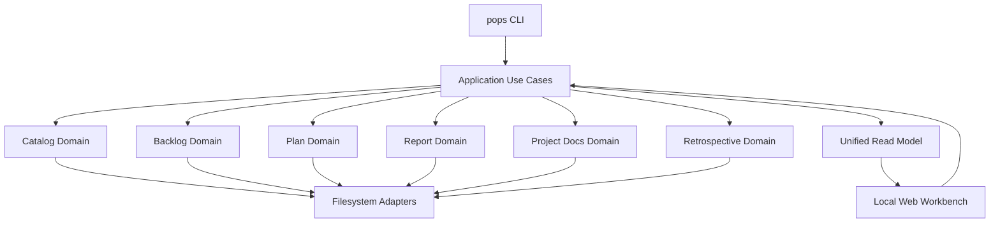

# ProjectOps 架构

## 架构概览

ProjectOps 采用 TypeScript/Node.js 单运行时 modular monolith。CLI、Local Web Workbench 和未来 Agent 接口
共享 application/domain implementation；模块间不通过 CLI subprocess 通信。



当前 Repo 仅包含最小 CLI bootstrap；上图是新增纵向能力时必须保持的目标依赖方向。

## 核心技术栈

| 层 | 技术 | 当前选择理由 |
|---|---|---|
| Runtime | Node.js 22+ | CLI、server 和构建使用单运行时 |
| Language | TypeScript | 共享 domain、application、CLI 和 Web contract |
| Package manager | npm | 降低初始工具数量 |
| Persistence | Markdown/JSON files | 人类可读、Git-friendly、Agent 可操作 |
| Tests | Node test runner + tsx | 无额外测试框架，覆盖代表性 happy path |
| Web | 未选择 | 到 Workbench 阶段再根据实际需求决定 |

## 模块边界

```text
interfaces (CLI/Web)
        ↓
application use cases
        ↓
domain modules
        ↓ ports
filesystem/runtime adapters
```

- Domain 不读取 Catalog、环境变量、HTTP request 或 CLI arguments。
- Catalog 只拥有 workspace/project topology，不解析领域 artifact 内容。
- Application 层编排跨领域 use case，不复制领域状态机。
- Read Model 是可重建 projection，不是业务 authority。
- 新抽象必须至少解决当前存在的两个调用方或重复问题。

## 初始 CLI 流程

1. `src/cli.ts` 把参数和 I/O adapter 交给 `runCli`。
2. `src/app.ts` 处理当前 `--help` 和 `--version` happy path。
3. CLI 以 exit code 表达成功或未知命令。
4. 后续 command 按纵向用例加入 application/domain module，不在入口文件堆叠存储逻辑。

## 数据与运行时边界

- 业务数据使用 versioned Markdown/JSON schema。
- 初期不引入数据库、缓存、后台 daemon 或插件系统。
- locks、cache、logs 和临时数据不得进入版本化 artifact。
- 当前威胁模型是受信任本地用户与 workspace。
- Alpha 不承诺恶意 symlink、ancestor-swap、复杂并发、crash consistency 或跨平台原子性。
- 写入仍必须限制在命令明确选择的 workspace 内，且默认不覆盖已有用户文件。

## 关键架构约束

- 产品名为 ProjectOps，CLI 名为 `pops`。
- 最终发行边界是一个产品包和一个生产运行时。
- 各领域拥有独立 schema 与 lifecycle。
- Workbench 是 application API 的交互入口，不拥有第二套业务实现。
- 现有 Workspace Control 不属于运行时依赖，也不在核心实现中加入兼容或迁移代码。

