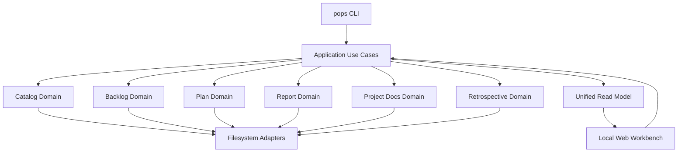

# ProjectOps 架构

## 架构概览

ProjectOps 采用 TypeScript/Node.js 单运行时 modular monolith。CLI、Local Web Workbench 和未来 Agent 接口
共享 application/domain implementation；模块间不通过 CLI subprocess 通信。



当前 Repo 已落地 Workspace/Catalog、Backlog、Plan authoring/query/validation/approval/materialization、Project Docs
scaffold/check，以及 Report@1 schema、Markdown filesystem adapter、单 Plan Report 生成资格校验和
`pops report create/list/show`；独立临时 workspace 的 built CLI smoke 已覆盖 Plan → Backlog → Report 的
completed 路径、logical references、验证证据和 no-clobber 行为。Retrospective 的 Retrospective@1/Store@1 schema、workspace manifest 路由、Markdown store bootstrap、可重建索引、capture/query 与 revision-protected triage/archive lifecycle 已落地；独立临时 workspace 的 built CLI E2E 还验证了 metadata 保留、唯一 authority 移动、索引计数和 stale revision 不变式。Workbench 的 UI-neutral typed Application API、按请求重建的 workspace/project Read Model、loopback-only Local HTTP server 以及基于纯 TypeScript/原生 ESM 的可导航 Workbench 前端壳已落地，生产 build 由本地 server 直接托管；Backlog 可写切片和 Plan/Report/Docs/Retrospective 完整只读视图已交付。上图是新增纵向能力时必须保持的目标依赖方向。

## 核心技术栈

| 层 | 技术 | 当前选择理由 |
|---|---|---|
| Runtime | Node.js 22+ | CLI、server 和构建使用单运行时 |
| Language | TypeScript | 共享 domain、application、CLI 和 Web contract |
| Package manager | npm | 降低初始工具数量 |
| Persistence | Markdown/JSON files | 人类可读、Git-friendly、Agent 可操作 |
| Tests | Node test runner + tsx | 无额外测试框架，覆盖代表性 happy path |
| HTTP | Node.js `node:http` | 直接复用单运行时，不增加 server framework |
| Web UI | 纯 TypeScript + 原生 ESM + 现代 CSS | 保持单运行时与零重型外部依赖，兼顾可访问性与直接静态托管 |

## 模块边界

```text
interfaces (CLI/Web)
        ↓
application use cases
        ↓
domain modules
        ↓ ports
filesystem/runtime adapters
```

- Domain 不读取 Catalog、环境变量、HTTP request 或 CLI arguments。
- Catalog 只拥有 workspace/project topology，不解析领域 artifact 内容。
- Application 层编排跨领域 use case，不复制领域状态机。
- Read Model 是可重建 projection，不是业务 authority。
- 新抽象必须至少解决当前存在的两个调用方或重复问题。

当前代码结构：

```text
src/
  cli.ts                  interfaces：进程入口，注入 stdout/stderr/stdin
  workbench.ts            interfaces：Local HTTP server 进程入口与 signal shutdown
  app.ts                  application：命令路由与退出码
  io.ts                   CliIO 契约
  application/
    result.ts             UI-neutral typed success/error contract
    workspaceApi.ts       workspace identity 与 project summaries 查询
    backlogApi.ts         Backlog list/show/revision-protected update API
    workspaceInspection.ts workspace doctor 的 typed inspection API
    workbenchReadModel.ts workspace/project 跨领域只读 projection
  server/
    workbenchServer.ts    HTTP routes、request boundary、static assets 与 server lifecycle
  web/
    index.html            Workbench HTML 骨架与挂载点
    style.css             无外部依赖的现代 CSS、可见 focus 与语义化样式
    types.ts              前端 AppState、ViewType 与只读模型契约
    router.ts             URL Hash 路由解析、格式化与状态恢复
    apiClient.ts          HTTP API 客户端与网络/格式错误收敛
    backlogController.ts Backlog 列表、详情、revision mutation 与异步响应隔离
    backlogView.ts        Backlog 分组列表、详情、依赖提示和更新控件
    state.ts              前端状态机核心与不可变状态转移
    readPagesView.ts       Plan/Report/Docs/Retrospective 只读详情与回顾过滤
    render.ts             语义化 HTML 纯函数渲染与可访问性属性
    app.ts                生命周期编排、事件委托与 DOM 挂载
  catalog/
    workspace.ts          Catalog domain：Manifest@1 schema 与纯路径逻辑
    workspaceStore.ts     filesystem adapter：发现、读写 workspace manifest
  backlog/
    store.ts              Backlog domain：store manifest schema
    add.ts                Backlog application helper：CLI 与 Plan materialization 共享 item 创建规则
    item.ts               Backlog domain：item schema、frontmatter 序列化、revision
    storeFs.ts            filesystem adapter：store 创建与读取
    itemFs.ts             filesystem adapter：item 文件读写
  plan/
    plan.ts               Plan domain：Plan@1 schema、校验与生命周期
    planFs.ts             filesystem adapter：Plan artifact 的列出、读写与解析
  report/
    report.ts             Report domain：Report@1 schema 与稳定 Markdown 序列化
    reportFs.ts           filesystem adapter：Report 的 containment、列出、读取与 no-clobber 创建
  retrospective/
    retrospective.ts      Retrospective@1 与 Store@1 schema、Markdown 序列化
    retrospectiveFs.ts    workspace-level store bootstrap、containment、capture、读写、revision-protected transition 和索引重建
  docs/
    projectDocs.ts        Project Docs domain：固定角色和内置 Markdown 模板
    projectDocsFs.ts      filesystem adapter：预检、canonical containment、no-clobber scaffold
  useCases/
    docsScaffold.ts       application：创建固定 Project Docs 文件
    docsCheck.ts          application：只读检查固定 Project Docs 文件
    reportContext.ts      application：解析已登记 project 的 typed reports root
    reportGenerate.ts     application：从持久化 materialized Plan 与同项目 Backlog 生成 Report
    reportCreate.ts       application：`pops report create` 参数解析与 Report 生成入口
    reportList.ts         application：`pops report list` 摘要查询
    reportShow.ts         application：`pops report show` 完整查询
    retrospectiveContext.ts application：解析 Manifest@1 的 workspace retrospectives descriptor
    retrospectiveCapture.ts application：`pops retrospective capture` 参数校验和 inbox 写入
    retrospectiveList.ts application：`pops retrospective list` 过滤和 malformed diagnostics
    retrospectiveShow.ts application：`pops retrospective show` 完整记录查询
    retrospectiveTriage.ts application：`pops retrospective triage` 分类并将 inbox 记录移入 active/archive
    retrospectiveArchive.ts application：`pops retrospective archive` 将 active 记录结案到 archive
    ...                    每个 CLI 子命令一个 use case，编排 domain 与 adapters
```

`src/application/` 是 CLI、Local Web Workbench 与未来 Agent interface 的共享调用面。它接收 typed request，
返回 `ApplicationResult<T>`，不解析 CLI arguments、不格式化 JSON、不依赖 `CliIO`、HTTP 或 UI 类型，也不在
错误结果中暴露机器绝对路径。当前覆盖 workspace/project 查询、Backlog
list/show/update 以及四个领域的完整只读 projection；现有 CLI 对应命令负责参数、文本/JSON 输出和退出码，并把业务处理委托给这些 API。其他
领域仍按需求逐步迁移，不建立通用 command bus 或 Artifact service。

`workbenchReadModel.ts` 直接组合各领域公开读取能力。workspace overview 包含 workspace identity、稳定排序的
project summaries 与 doctor diagnostics；project overview 包含 Backlog 状态计数/最近条目、Plan/Report 摘要、
Docs check、project-scoped Retrospective 计数和最近记录。projection 不保存状态；malformed artifact 或单领域
不可用时返回按 source/reference 稳定排序的 diagnostics，并继续返回其他可用领域，不复制 schema parser。

`workbenchServer.ts` 是 application API 外的薄 HTTP adapter。启动参数固定唯一 workspace，并默认绑定
`127.0.0.1:7331`；host 只接受 loopback，测试可使用 port `0` 获取隔离端口。路由提供 workspace/project
overview、Backlog list/show/update 和 `GET /api/projects/<id>/read-pages`，统一返回 `{ ok, data }` 或 `{ ok, error }` JSON envelope，并把 stale
revision 映射为 HTTP 409。请求不能提供 workspace path；除 Backlog list 的 `status` 外拒绝 query 参数。
PATCH 只接受 `application/json`、无 Origin 或与 server origin 完全相同的 Origin，以及仅含 `status` 和可选
`expected_revision` 的有界 body。server 可从显式 static root 提供前端资源，realpath containment 防止 URL
访问 root 外文件；未提供 static root 时自动查找内置 `dist/web` 生产资源，只有资源尚未构建时才返回占位页。
关闭先停止接收连接，随后有界清理残留连接。

`getWorkbenchReadPages` 与 overview 共享 Plan/Report/Retrospective 领域读取器和 Docs check，返回 `WorkbenchReadPages`：
Plan、Report 保留各自 domain 类型，Docs 从 `PROJECT_DOC_TEMPLATES` 派生固定路径及检查结果，Retrospective
返回完整 workspace 记录。单个 malformed 文件被转换为诊断，不中断其他有效文件；不通过 CLI subprocess、
CLI JSON 或前端 schema parser 读取数据。此 projection 按需从 read-pages endpoint 加载，Alpha 阶段一次返回
四个领域的完整内容，无分页或持久化缓存；overview 继续保留轻量摘要契约。

`readPagesView.ts` 以原生 `<details>` 提供可键盘展开的 Plan、Report 和 Retrospective 详情，正文转义后以源文显示。
Retrospective 在完整 typed 列表上按 status/project/task 精确过滤，默认 project 为当前项目，留空表示全部，
`null` 表示 provenance 未记录；按 inbox/active/archive 分组并保留不受过滤影响的 malformed diagnostics。
Docs 只展示固定路径和共享检查结果。`app.ts` 管理按需加载、重试、刷新和过滤状态，使用请求序号隔离过期响应；
项目切换清除旧 projection 并重置过滤。四个领域没有 Web mutation 或任意文件读取接口。

Workbench Backlog 页面通过 HTTP list/show/update 获取完整数据，独立于 overview 的最近五条摘要。
`backlogController.ts` 管理列表、当前详情和提交状态：提交携带已加载 revision，成功后重读列表和详情并刷新
project overview；409 保留旧详情和当前选择，用户显式刷新后才能再次提交。项目切换会废弃旧请求的 UI
结果，进行中的提交不允许重复触发。页面依据 `depends_on` 与已读取 item 状态显示未完成/缺失依赖提示，
不引入额外的 mutation 规则。Markdown 正文以转义的源文显示，不解释其中 HTML。
workspace 连接重试期间的路由变化只更新目标路由，待 workspace 响应到达后再加载项目。

测试以隔离临时 workspace、port `0` 和真实 HTTP API 覆盖列表、DOM 事件分发、更新后的 authority 文件、
project summary、revision conflict 与刷新重试；只读视图测试覆盖四领域正常、空状态与诊断、完整详情、回顾过滤、刷新和读取前后文件不变；
异步单元测试覆盖项目切换和重复提交。完整浏览器 E2E
仍属于后续收口阶段。

## 数据文件格式

- workspace manifest：`.pops/workspace.json`，schema `workspace/Manifest@1`；不含绝对路径，project 以
  相对路径登记；顶层 `retrospectives` descriptor 使用 `type: workflow/retrospectives@1` 与相对 `root` 指向
  唯一 workspace-level Retrospective store，默认由 `pops init` 写入 `retrospectives/`。
- backlog store：`ops/<project-id>/backlog/`，含 `backlog.json`（`backlog/Store@1`，声明
  project_id 与 id_prefix）、`items/` 与 `INDEX.md`。
- backlog item：`items/<ID>.md`，YAML 风格 frontmatter + Markdown body；`revision` 是其余内容的
  sha256 前 8 位，用于 `update --expected-revision` 的冲突保护。
- `INDEX.md` 是从 item 文件重建的可读 projection；add 和真实状态变更后同步刷新，no-op 不改写。
- Plan：`plans/plan-<title-slug>.json`，schema 为 `plan/Plan@1`；包含标题、目标与带局部 key、parent/依赖的 item 草案，
  以及 `status: draft|approved`；批准 Plan 以单个 `approval` 对象记录 `approved_at` 和 `review_note`，materialize 后以
  `materialization.mapping` 记录局部 key 到 Backlog ID 的映射以及 `materialized_at`。
  无 ASCII slug 的标题使用 Unicode code point 的 `u<hex>` token。create 验证 plans descriptor 为精确 schema type，
  并在写入前验证 plans root 的 canonical 路径仍在 workspace 内；随后使用 `wx` no-clobber 写入。list/show 读取同一
  artifact；`plan materialize` 直接调用 Backlog application helper，按拓扑顺序创建同一 project 的条目，并在完整成功后更新 Plan。
- Project Docs：`pops docs scaffold <project>` 为已登记 project 的四个固定路径生成内置 Git-friendly Markdown 模板：`README.md`、`AGENTS.md`、
  `docs/PRODUCT_SPEC.md` 和 `docs/ARCHITECTURE.md`。模板内容由 Docs domain 持有；application use case 预检 project、docs parent 和全部目标，
  通过 `wx` 创建缺失文件，已有普通文件跳过并在 JSON receipt 的 `created`/`skipped` 中返回。canonical 路径必须仍位于 project 和 workspace 内，
  非普通目标或越界 parent 会在写入前失败。
- `pops docs check <project>` 复用同一固定文档集合，只读使用 `lstat` 检查目标为普通文件并读取内容确认存在 Markdown 一级标题；符号链接按非普通文件诊断，
  缺失、非普通或缺少标题时按固定路径顺序收集全部 `problems`，不写入 project。
- Report：`reports/report-<slug>.md` 使用独立的 `report/Report@1` frontmatter，保存标题、project、`created_at`、outcome、Plan logical reference、
  Backlog 结果、验证证据、偏离、workaround 与 `repo_docs`（Repo-relative 文档路径，如 `README.md`），正文为 Markdown body。Report adapter 只接受 workspace 内的 reports root，拒绝缺失或非目录 root、
  非普通 target、schema 无效文件和已存在 target；写入使用 `wx` no-clobber，序列化不会注入机器绝对路径。
- Report generation 先从 `plansRoot` 读取并校验指定的已批准、已 materialize Plan，再按 mapping 读取同一 project 的 Backlog 条目；Report 记录所有映射结果，`completed|partial` 只由 task 的实际状态和显式 partial 说明决定，生成失败不写入 Report。CLI 通过 `--verification` 记录验证证据，未完成 task 必须以非空 `--partial-acceptance` 显式接受 partial。
- Retrospective store：`retrospectives/retrospective.json` 声明 `retrospective/Store@1`、记录 schema 与索引 schema；`inbox/`、`active/`、`archive/` 保存 `*.md` 权威记录，`index.json` 和 `INDEX.md` 是可重建派生索引。Retrospective@1 的 `project`、`task` provenance 可为显式 `null`，但不能缺失；triage metadata 使用 `disposition`、`owner_scope`、`categories`、`next_action`、`related_info`，archive metadata 使用 `action_disposition`、`actioned_at`、`backlog`、`resolution_note`，并保留已有的 `next_action`。Store adapter 只接受 manifest descriptor 指定且位于 workspace 内的静态目录，bootstrap 和记录创建均使用 no-clobber；不把 Retrospective 纳入 per-project artifact 状态机。capture/transition 的共享锁按 store 相对路径生成稳定 identity，存放在 workspace `.pops/runtime/retrospectives/`，不写入版本化 Retrospective root。
- Retrospective capture 只保存调用方提供的证据并强制写入 `inbox/`；Markdown body 必须包含三个非空 section：`Hidden friction encountered`、`Workarounds used` 和 `Improvement candidates`。记录输出的 revision 是 Markdown 文件内容 sha256，列表按相对 path 稳定排序并支持 status/project/task 过滤。显式 ID 与自动 ID 都在共享锁内跨 `inbox/`、`active/`、`archive/` 检查唯一性，自动 suffix 从所有状态和已有重试记录中分配。读取列表将 malformed 记录转换为 diagnostics，避免单个文件破坏 read model；capture 在索引刷新失败时回滚本次文件和完整索引快照，并清理已创建后发生写入错误的部分文件。`triage` 只允许 `inbox → active|archive`，显式要求 `--to` 和非空 `--next-action`；`archive` 只允许 `active → archive`，保留记录已有的 `next_action`，其 `--backlog` 只接受 `project-ops:backlog/items/<PREFIX>-NNN.md`。两者在共享锁内校验 expected revision、静态 regular target 与 no-clobber 目标，失败回滚 source/target/index 快照，成功后重建派生索引。不把 Retrospective 纳入 per-project artifact 状态机。

## 当前 CLI 流程

1. `src/cli.ts` 把参数、I/O adapter 和 cwd 交给 `runCli`。
2. `src/app.ts` 路由到命令：`init`、`project add|list|doctor`、`docs scaffold|check`、`backlog init|add|list|show|update`、`plan create|list|show|validate|approve|materialize`、`report create|list|show`、`retrospective capture|list|show|triage|archive`；Retrospective capture/query/transition 共享同一 domain/adapter。
3. 每个子命令对应 `src/useCases/` 下的一个 use case，编排 domain 逻辑与 filesystem adapter；Docs scaffold 由 `docsScaffold.ts` 调用共享的 Docs domain 和 adapter，Docs check 由 `docsCheck.ts` 调用同一 Docs adapter；Plan 的 create/list/show/validate/approve/materialize 共享同一 `plan/` domain 和 filesystem adapter，Report 的 create/list/show 共享同一 Report domain 和 filesystem adapter；Plan materialize 通过 `backlog/add.ts` 复用 Backlog item 创建规则，不启动内部 CLI subprocess。
   `project list` 与 Backlog list/show/update 已成为薄 CLI adapter，调用 `src/application/` 的 typed API；Web
   后续直接调用同一 API，不复用 CLI 参数或输出格式。
4. use case 以退出码表达成功、明确错误或 unknown 命令；非 JSON 错误信息写 stderr，机器可读结果经 `--json` 写 stdout（Report 命令的 JSON 失败结果也使用稳定 error envelope）。
5. Report CLI 的 create/list/show 共享同一 Report application/domain 与 filesystem adapter；create 先完成 Plan/Backlog 资格校验，再以 no-clobber 写入 `reports/report-<slug>.md`。
6. 后续 command 按纵向用例加入对应 domain module，不在入口文件堆叠存储逻辑。

`project doctor` 校验 Manifest@1 的 typed artifact 声明以及 project/artifact root 的目录类型。结构损坏的
manifest 在进入 use case 前作为明确错误拒绝；doctor 只报告问题，不自动修复。

## 数据与运行时边界

- 业务数据使用 versioned Markdown/JSON schema。
- 初期不引入数据库、缓存、后台 daemon 或插件系统。
- locks、cache、logs 和临时数据不得进入版本化 artifact。
- Workbench Read Model 按请求从 authority 重建，不引入数据库、缓存或后台 daemon；其 relative/logical references
  与 diagnostics 可传给 interface，filesystem 绝对 root 只保留在 application 内部。
- Local HTTP server 的 workspace 和可选 static root 只在启动时选择，HTTP 请求不能更换它们；错误响应不返回
  stack trace 或机器绝对路径。server 不持久化业务数据之外的第二份状态。
- 当前威胁模型是受信任本地用户与 workspace。
- Alpha 不承诺恶意 symlink、ancestor-swap、复杂并发、crash consistency 或跨平台原子性。
- 写入仍必须限制在命令明确选择的 workspace 内，且默认不覆盖已有用户文件。
- backlog item 文件名只接受当前 store prefix 加数字序号，CLI 参数不能通过路径片段访问 store 外文件。

## 关键架构约束

- 产品名为 ProjectOps，CLI 名为 `pops`。
- 最终发行边界是一个产品包和一个生产运行时。
- 各领域拥有独立 schema 与 lifecycle。
- Workbench 是 application API 的交互入口，不拥有第二套业务实现。
- 现有 Workspace Control 不属于运行时依赖，也不在核心实现中加入兼容或迁移代码。
