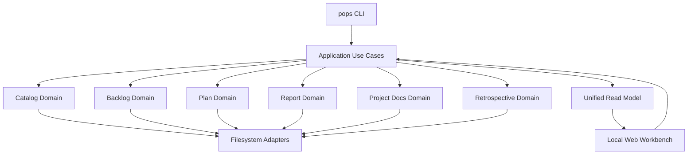

# ProjectOps 架构

## 架构概览

ProjectOps 采用 TypeScript/Node.js 单运行时 modular monolith。CLI、Local Web Workbench 和未来 Agent 接口
共享 application/domain implementation；模块间不通过 CLI subprocess 通信。



当前 Repo 已落地 Workspace/Catalog、Backlog 与 Plan authoring/query 纵向切片；Plan 的 validation、review、approval
与 materialization，以及 Report、Docs、Retrospective、Workbench 仍是目标域，上图是新增纵向能力时必须保持的目标依赖方向。

## 核心技术栈

| 层 | 技术 | 当前选择理由 |
|---|---|---|
| Runtime | Node.js 22+ | CLI、server 和构建使用单运行时 |
| Language | TypeScript | 共享 domain、application、CLI 和 Web contract |
| Package manager | npm | 降低初始工具数量 |
| Persistence | Markdown/JSON files | 人类可读、Git-friendly、Agent 可操作 |
| Tests | Node test runner + tsx | 无额外测试框架，覆盖代表性 happy path |
| Web | 未选择 | 到 Workbench 阶段再根据实际需求决定 |

## 模块边界

```text
interfaces (CLI/Web)
        ↓
application use cases
        ↓
domain modules
        ↓ ports
filesystem/runtime adapters
```

- Domain 不读取 Catalog、环境变量、HTTP request 或 CLI arguments。
- Catalog 只拥有 workspace/project topology，不解析领域 artifact 内容。
- Application 层编排跨领域 use case，不复制领域状态机。
- Read Model 是可重建 projection，不是业务 authority。
- 新抽象必须至少解决当前存在的两个调用方或重复问题。

当前代码结构：

```text
src/
  cli.ts                  interfaces：进程入口，注入 stdout/stderr/stdin
  app.ts                  application：命令路由与退出码
  io.ts                   CliIO 契约
  catalog/
    workspace.ts          Catalog domain：Manifest@1 schema 与纯路径逻辑
    workspaceStore.ts     filesystem adapter：发现、读写 workspace manifest
  backlog/
    store.ts              Backlog domain：store manifest schema
    item.ts               Backlog domain：item schema、frontmatter 序列化、revision
    storeFs.ts            filesystem adapter：store 创建与读取
    itemFs.ts             filesystem adapter：item 文件读写
  useCases/               每个 CLI 子命令一个 use case，编排 domain 与 adapters
```

## 数据文件格式

- workspace manifest：`.pops/workspace.json`，schema `workspace/Manifest@1`；不含绝对路径，project 以
  相对路径登记。
- backlog store：`ops/<project-id>/backlog/`，含 `backlog.json`（`backlog/Store@1`，声明
  project_id 与 id_prefix）、`items/` 与 `INDEX.md`。
- backlog item：`items/<ID>.md`，YAML 风格 frontmatter + Markdown body；`revision` 是其余内容的
  sha256 前 8 位，用于 `update --expected-revision` 的冲突保护。
- `INDEX.md` 是从 item 文件重建的可读 projection；add 和真实状态变更后同步刷新，no-op 不改写。
- Plan：`plans/plan-<title-slug>.json`，schema 为 `plan/Plan@1`；包含标题、目标与带局部 key/依赖的 item 草案。
  无 ASCII slug 的标题使用 Unicode code point 的 `u<hex>` token。create 验证 plans descriptor 为精确 schema type，
  并在写入前验证 plans root 的 canonical 路径仍在 workspace 内；随后使用 `wx` no-clobber 写入。list/show 读取同一
  artifact；当前不 materialize Backlog。

## 当前 CLI 流程

1. `src/cli.ts` 把参数、I/O adapter 和 cwd 交给 `runCli`。
2. `src/app.ts` 路由到命令：`init`、`project add|list|doctor`、`backlog init|add|list|show|update`、`plan create|list|show`。
3. 每个子命令对应 `src/useCases/` 下的一个 use case，编排 domain 逻辑与 filesystem adapter；Plan 的 create/list/show
   共享同一 `plan/` domain 和 filesystem adapter。
4. use case 以退出码表达成功、明确错误或 unknown 命令；错误信息写 stderr，机器可读结果经 `--json` 写 stdout。
5. 后续 command 按纵向用例加入对应 domain module，不在入口文件堆叠存储逻辑。

`project doctor` 校验 Manifest@1 的 typed artifact 声明以及 project/artifact root 的目录类型。结构损坏的
manifest 在进入 use case 前作为明确错误拒绝；doctor 只报告问题，不自动修复。

## 数据与运行时边界

- 业务数据使用 versioned Markdown/JSON schema。
- 初期不引入数据库、缓存、后台 daemon 或插件系统。
- locks、cache、logs 和临时数据不得进入版本化 artifact。
- 当前威胁模型是受信任本地用户与 workspace。
- Alpha 不承诺恶意 symlink、ancestor-swap、复杂并发、crash consistency 或跨平台原子性。
- 写入仍必须限制在命令明确选择的 workspace 内，且默认不覆盖已有用户文件。
- backlog item 文件名只接受当前 store prefix 加数字序号，CLI 参数不能通过路径片段访问 store 外文件。

## 关键架构约束

- 产品名为 ProjectOps，CLI 名为 `pops`。
- 最终发行边界是一个产品包和一个生产运行时。
- 各领域拥有独立 schema 与 lifecycle。
- Workbench 是 application API 的交互入口，不拥有第二套业务实现。
- 现有 Workspace Control 不属于运行时依赖，也不在核心实现中加入兼容或迁移代码。
